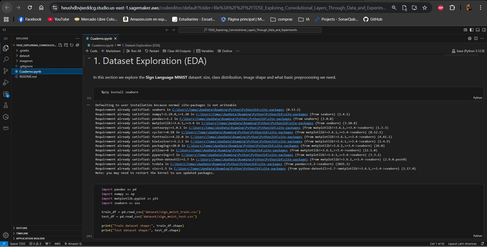
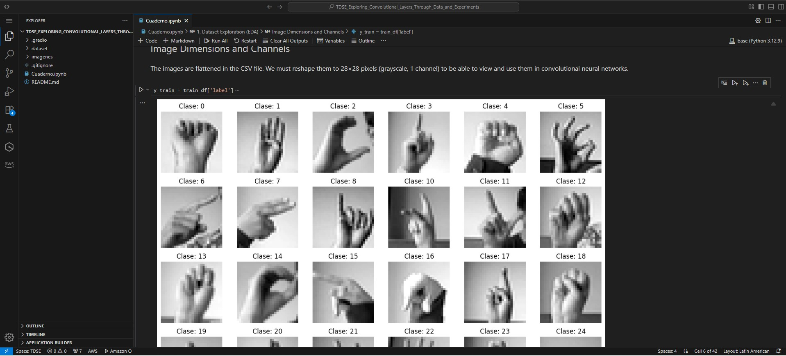
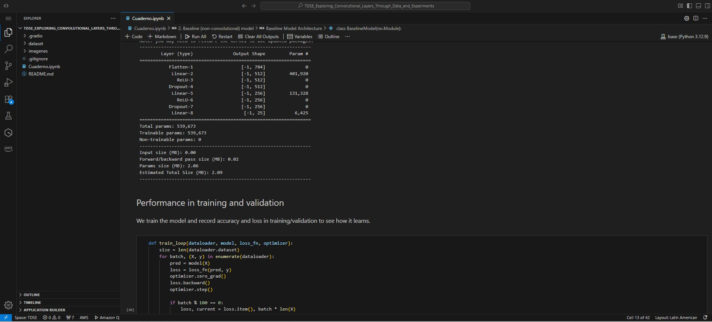
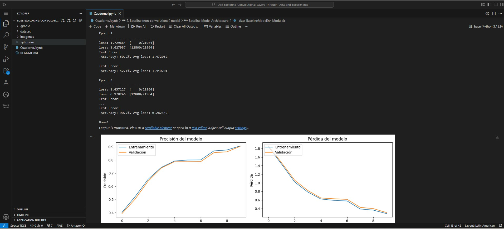
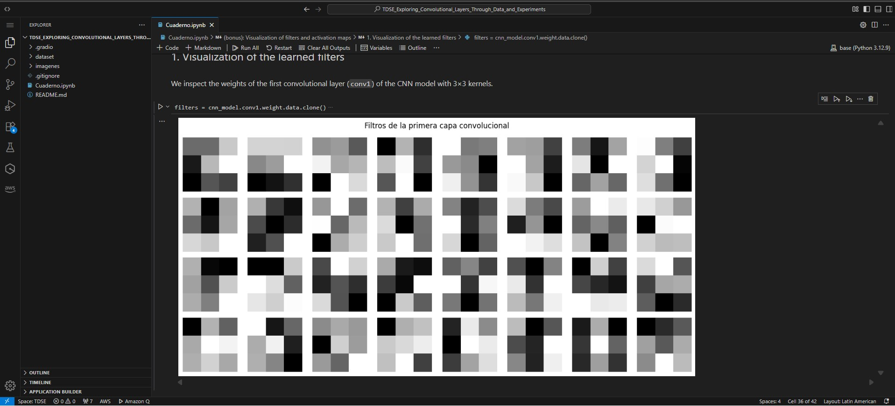
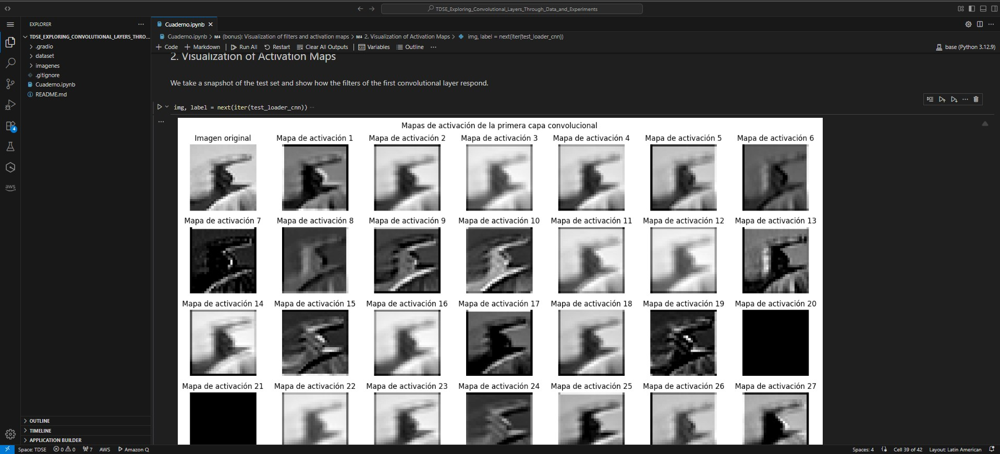
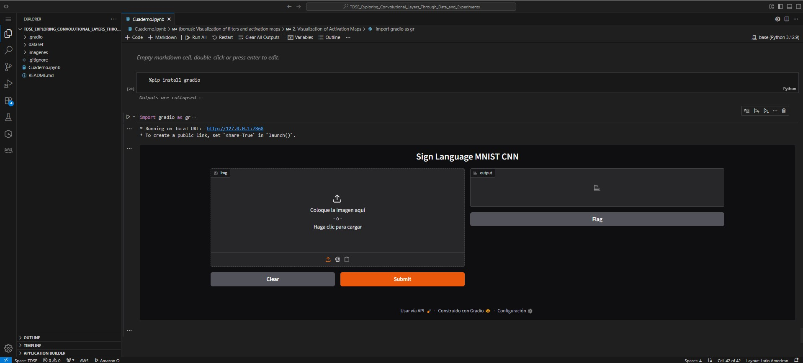

# MNIST Sign Language — Exploring Convolutional Layers
Author: Tomas Felipe Ramirez Alvarez

A brief repository containing the `Cuaderno.ipynb` file for exploring, training, and diagnosing CNN models on the MNIST Sign Language dataset.

**Summary**
- Objective: To compare architectures (3x3 vs. 5x5 kernels), understand filters/activations, and provide an interactive demonstration with Gradio.

## 1. Dataset Exploration (EDA)
Provide a concise analysis including:

- Dataset size and class distribution
- Image dimensions and channels
- Examples of samples per class
- Any preprocessing needed (normalization, resizing)

The goal is understanding the structure, not exhaustive statistics.

## 2. Baseline Model (Non-Convolutional)
Implement a baseline neural network without convolutional layers, e.g.:
- Flatten + Dense layers

Report:

-  Architecture
- Number of parameters
- Training and validation performance
- Observed limitations

This establishes a reference point.

## 3. Convolutional Architecture Design
Design a CNN from scratch, not copied from a tutorial.

You must explicitly define and justify:

- Number of convolutional layers
- Kernel sizes
- Stride and padding choices
- Activation functions
- Pooling strategy (if any)

The architecture should be simple but intentional, not deep for its own sake.

## 4. Controlled Experiments on the Convolutional Layer
Choose one aspect of the convolutional layer and explore it systematically.

Examples (pick one):

- Kernel size (e.g. 3×3 vs 5×5)
- Number of filters
- Depth (1 vs 2 vs 3 conv layers)
- With vs without pooling
- Effect of stride on feature maps

Keep everything else fixed.

Report:

- Quantitative results (accuracy, loss)
- Qualitative observations
- Trade-offs (performance vs complexity)

## 5. Interpretation and Architectural Reasoning
Answer in your own words:

- Why did convolutional layers outperform (or not) the baseline?
- What inductive bias does convolution introduce?
- In what type of problems would convolution not be appropriate?

This section is graded heavily.

## 6. Deployment in Sagemaker

- Train the model in Sagemaker
- Deploy the model to a sagemaker endpoint
----
**Key Content**
- Notebook: `Cuaderno.ipynb` — EDA, models (baseline and CNN), controlled experiments, and visualization of filters/activations.

- Data: `dataset/sign_mnist_train.csv`, `dataset/sign_mnist_test.csv`.

**Quick Requirements**
- Install the minimum dependencies:

```bash
pip install torch torchvision pandas matplotlib seaborn pillow gradio scikit-learn
```
**conclusions**
- Model performance: The CNN clearly outperforms the baseline and achieves high accuracy in validation; the model learns hand shapes robustly.
- Kernel size: The 3×3 vs. 5×5 experiment showed that 5×5 does not provide significant improvement and adds complexity; 3×3 is more efficient.
- Robustness and diagnostics: Consistent preprocessing (resize/grayscale) and diagnostic tools (top-3 probabilities, filter visualization) are key to detecting confounding and guiding upgrades or reprocessing.

**Evidencias**
# training and seasons
-  
-  
-  
-  
## bond
-  
- 

## deployment
- 
- 
---